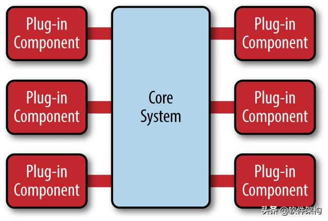

# MicroKernel Architecture

微核架构（micro-kernel architecture）又称为"插件架构"（plug-in architecture），  
指的是软件的内核相对较小，主要功能和业务逻辑都通过插件实现。  

  

内核（core）通常只包含系统运行的最小功能。  
插件则是互相独立的，插件之间的通信，应该减少到最低，避免出现互相依赖的问题。  
